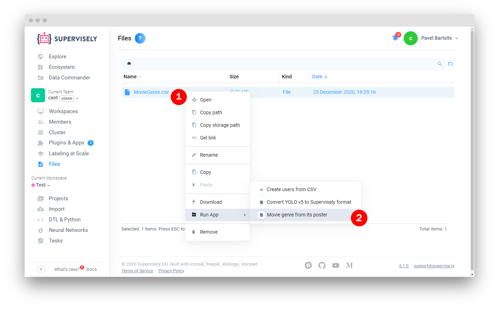
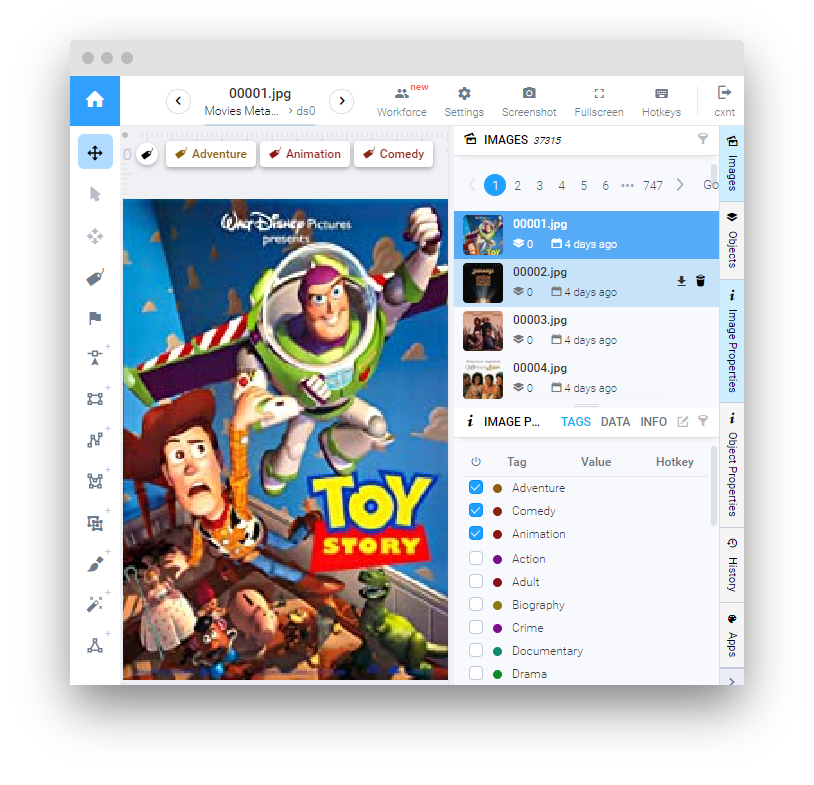

# Movie genre from its poster

  <a href="#Overview">Overview</a> •
  <a href="#Preparation">Preparation</a> •
  <a href="#How-To-Run">How To Run</a> •
  <a href="#How-To-Use">How To Use</a>

## Overview

Application imports [kaggle dataset](https://www.kaggle.com/neha1703/movie-genre-from-its-poster) to supervisely. The movie posters are obtained from IMDB website. Invalid image links will be skipped with the corresponding warning, that you can see in the application task log. Movie genres are assigned to the images as tags. The collected dataset also contains IMDB Id, IMDB Link, Title and IMDB Score as image metadata. Each Movie poster can belong to at least one genre and can have at most 3 genre tags assigned to it.

## Preparation

1. [Download dataset](https://www.kaggle.com/neha1703/movie-genre-from-its-poster) from kaggle and unpack `MovieGenre.csv` file to your computer.
2. Drag and drop `MovieGenre.csv` file to Team Files

## How To Run 
**Step 1**: Add app to your team from Ecosystem if it is not there. Application will be added to `Current Team`->`Plugins & Apps` page.

**Step 2**: Go to `Current Team`->`Files` page, right-click on `MovieGenre.csv` file and choose `Run App`->`Movie genre from its poster`.
 

**Note**: It may take some time to download and process all images

**Note**: Application will result in the supervisely project named: `Movie genre from its poster`, with 37315 images in the dataset.

